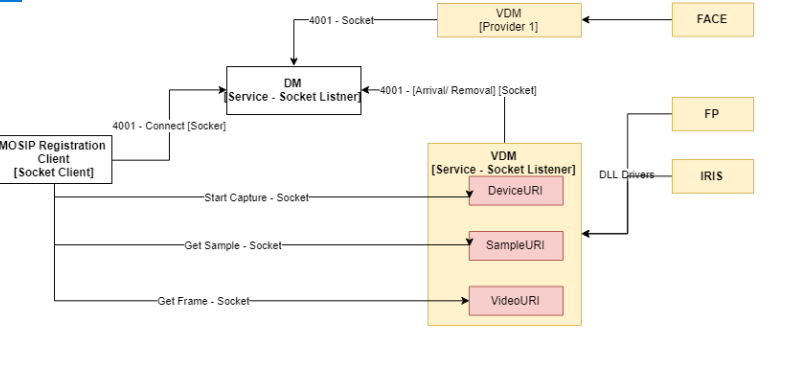
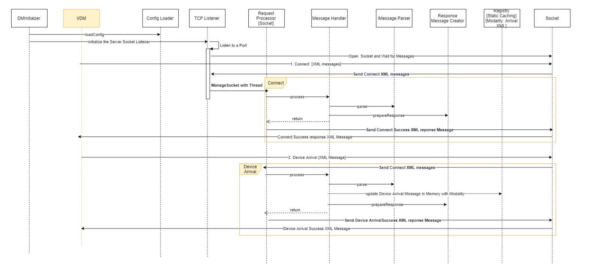
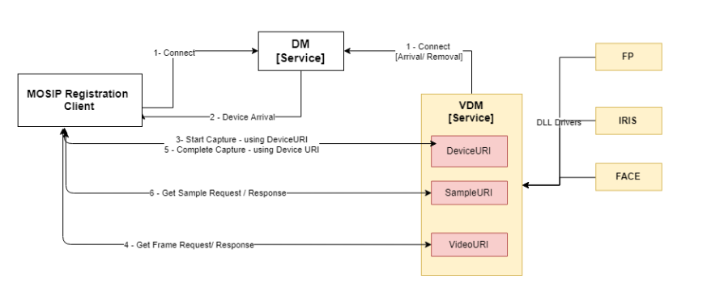
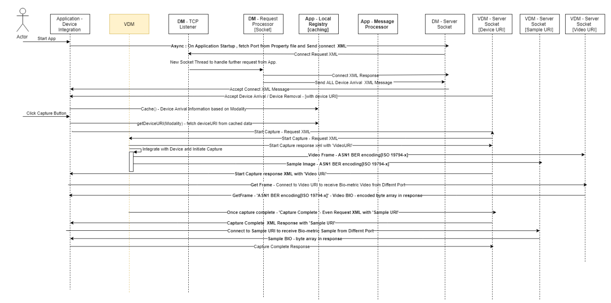

**Design - Bio-Metric Device Manager**

This document covers the technical design of Device Manager [DM], which will be used to Discover and Register  
the Bio-metric devices and forward the subjective information to MOSIP Registration client application.  
The Registration client application further uses the information to communicate with the device and capture the required bio-metric detail.    

There are three major entities are being considered to interact with Bio-metric devices. 
   1. VDM [Vendor Device Manager - Provided by External third party].  
   2. DM  [Device Manager - Provided by MOSIP].  
   3. Application [Registration client application - Provided by MOSIP].    

**Device Integration Block Diagram:**  
  

The technical detail of the DM and Registration client application is briefly covered in this document. VDM technical spec is out of this document.  

1. Mainly **TCP protocol** will be used to communicate between DM to VDM and Registration client Application to VDM services.  
2. DM and VDM services having listener component, it uses 'ServerSocket' from net package to make the communication with its client component.    
3. VDM internally uses required driver to communicate with the Bio-metric devices.    
4. Application opens the Socket communication with the defined port of DM and upon confirmation from DM, it makes the communication with VDM through Port.    
5. All requests and responses carry a requestId, which is a numeric value (128 bit), represented as a 36 character UUID format string in XML.  
6. VDM only captures the bio-metric images in standard ISO format and provide the same through TCP.  

**Out of Scope:** 
   - The VDM technical design is out of scope of this document.  
   - VDM doesn't provide the Segmentation, Matching, Extraction and quality of images. So it is not covered part of this Spec.  

**DM - Device Manager :** 
The Device Manager should open the connection with the configured port [from property file] and listen for messages from clients [VDM and Application]  

The MOSIP provided DM service, is responsible for the following:  
   - Listen on the device arrival and removal events from the vendor-specific device 
     manager (VDM).  
   - Maintain the list of the all the supported biometric devices available for the
     applications.  
   - Notify the applications about arrival and removal of the supported devices (
     PNP).  
   - The requestId is used to connect requests with the appropriate response.   
   - DM Listener create a separate Socket thread for each VDM and application.  
   - The VDM uses the same Socket for all the underlying devices communication. 
   - The application uses the same Socket for all the communication with DM. 

**Device Arrival - Class Diagram:**  
  

**Device Arrival - Sequence Diagram:**  
  

  
**DM Consuming messages:** 
   1. Connect  
   2. Ping  
   3. Device Arrival  
   4. Device Removal  

Refer the request and response xml message from VDM Specification:  
  

**Application :**  
 The Application must connect to the DM to discover the biometric devices.  
Once discovered, the application must connect to the required devices. These connections   
are maintained for the **life of the application**, and the application must expect to receive   
notifications and events about the device arrivals and removals during this time.  

   - Once the application started then load the DM running ports from property file.  
   - Span a separate thread to check the connectivity with the DM defined ports.  
   - If connected then send the 'Connect' message to DM.   
   - Once send the success response to application then DM will send the available device detail to application.  
   - Application can use the 'Device A 

  
**Application consuming XML Messages:** 
   1. Connect  
   2. Subscribe  
   3. Start Capture    
   4. Stop Capture  
   5. Complete Capture  
   6. Get Frame  
   7. Get Sample    
   8. Device Available  

Refer the request and response xml message from VDM Specification:  
  

**On click of capture button in application UI:**  

  

**Device Available:**
	A timer would be configured in the application to regularly call the DM to check for the availability of devices.  
	Below provided XML message would be prepared and send to the DM to confirm the device status.  
	Based on this the flag in the UI would be updated.  
	This request would regularly update the local cache about the device status, which would be used during capture process.  
	
<DeviceManagerEventRequest requestId="">  
	<Available deviceModality="" />  
</DeviceManagerEventRequest>  

<DeviceManagerEventResponse requestId="">  
	<Available value="" failureReason="0"/> 
</DeviceManagerEventResponse> 

**VDM :**  

  This service only supports the capturing of Bio-metric images from the devices. It doesn't provide the features to segment or match the bio-metric data.  
  	
   - deviceURI :The device should reject the connections on the deviceURI, until the existing socket is closed.  
   - sampleURI : will be provided in the Complete Capture event request message.  
   - videoURI : will be provided in the response of Start Capture message.    
 
  
  